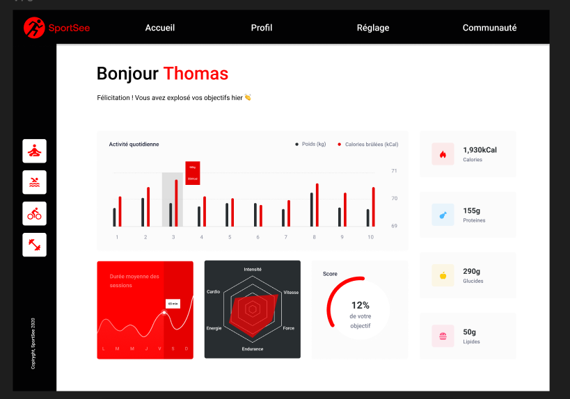

# Project 12 - Develop an Analytics Dashboard with React

## 📸 Preview



## 🔗 Live Demo

[SportSee Dashboard](https://sportsee-eta-five.vercel.app/)

## 🎨 Design Resources

- [Figma UI Design](https://www.figma.com/file/BMomGVZqLZb811mDMShpLu/UI-design-Sportify-FR?node-id=0%3A1)
- [Kanban Board & User Stories](https://www.notion.so/openclassrooms/Copy-of-Dev4U-projet-Learn-Home-6686aa4b5f44417881a4884c9af5669e)

## 📖 Description

This project is a React-based web application that fetches user analytics data from an API and displays it in a user-friendly dashboard. It allows developers to switch between real API data and mocked data for easier testing and development.

## 🛠 Technologies & Tools

- [Vite](https://vitejs.dev/)
- [React](https://react.dev/)
- [React Router](https://reactrouter.com/)
- [Node.js](https://nodejs.org/)
- [Recharts](https://recharts.org/)

## 🚀 Installation & Setup

### Clone the repository

```sh
git clone https://github.com/geekcrea/SportSee.git
```

### Install dependencies

```sh
npm install
```

### Start the development server

```sh
npm run dev
```

### (Optional) Use Sass for styling

```sh
sass --watch src/sass/main.scss src/css/style.css
```

## 🔧 Backend Setup

To run the backend, clone the repository and start the server:

```sh
git clone https://github.com/OpenClassrooms-Student-Center/P9-front-end-dashboard.git
cd P9-front-end-dashboard
npm install
npm run dev
```

## 📌 Notes

- Ensure you have **Node.js** and **NPM** installed before running the project.
- The project is optimized for local development but can be adapted for production use.

## 📝 License

This project is open-source and available under the [MIT License](LICENSE).

